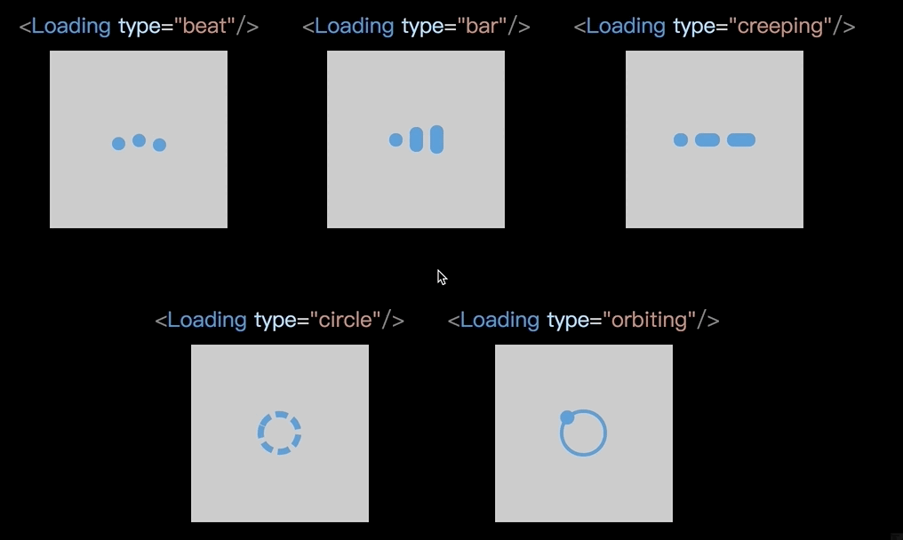

# react-loading-animate
A simple animate for loading with React component.

In this React library, All of animate style and design create by [this pen](https://codepen.io/Manoz/pen/pydxK), thank [Manoz](https://codepen.io/Manoz)!

## Installation

Install from npm:
```bash
npm install react-loading-animate --save
```
Import in your project:

```javascript
import Loading from 'react-loading-animate';
// Be sure to include styles at during use react-loading-animate.
import 'react-loading-animate/dist/main.css';
```

## Usage

react-loading-animate is easy to generate animate for loading with React component.

### Basic Usage


#### Code

```jsx
import React, { useState } from 'react';
import Loading from 'react-loading-animate';
import 'react-loading-animate/dist/main.css';

const App = () => {
  const [isLoading, setIsLading] = useState(false);
  const loading = () => {
    setIsLading(true);
    setTimeout(() => { setIsLading(false); }, 3000);
  };
  return (
    <div
      style={{
        width: '100%',
        height: '100%',
        display: 'flex',
        justifyContent: 'center',
        alignItems: 'center',
        background: '#000',
      }}
    >
      <button type="button" onClick={loading}>Start loading!</button>
      {isLoading ? <Loading /> : null}
    </div>
  );
};
```

### Other type of animate



### Basic Options

Option | Description | Type | Default |
:--- | :---: | :---: | :---
type | Have five type of animate, expect accpect `beat`, `bar`, `creeping`, `circle`, `orbiting`. | string | `beat` |
fill | Main color about animate element. | string | `#4b9cdb` |
zIndex | Will be set `z-index` of CSS on animate wrapp. | number | `10` |

### Options Of Specialty Animate Type 

#### beat

Option | Description | Type | Default |
:--- | :---: | :---: | :---: |
diameter | Each circle size of diameter. | number | `15` |
gap | Gap of each circle | number | `4` |

#### bar

Option | Description | Type | Default |
:--- | :---: | :---: | :---: |
width | Each element size of width. | number | `15` |
gap | Gap of each element | number | `4` |

#### creeping

Option | Description | Type | Default |
:--- | :---: | :---: | :---: |
height | Each element size of height. | number | `15` |
gap | Gap of each element | number | `4` |

#### circle

Option | Description | Type | Default |
:--- | :---: | :---: | :---: |
diameter | The circle size of diameter. | number | `15` |

#### orbiting

Option | Description | Type | Default |
:--- | :---: | :---: | :---: |
diameter | The ring size of diameter. | number | `15` |
